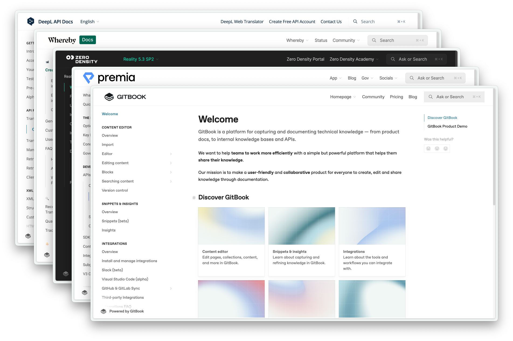

# GitBook

[Docs](https://docs.gitbook.com/) - [Community](https://github.com/GitbookIO/community) - [Developer Docs](https://developer.gitbook.com/) - [Changelog](https://changelog.gitbook.com/) - [Bug reports](https://github.com/GitbookIO/gitbook/issues/new?assignees=\&labels=bug\&template=bug\_report.md)

&#x20;[](./) [](LICENSE/) [](.github/contributing.md) [](https://github.com/gitbookIO/gitbook/issues)

Welcome to GitBook, the platform for managing technical knowledge for teams.

This repository contains the open source code used to render GitBook's published content.

<div align="center">



</div>

## Table of Contents

* [Getting Started](./#getting-started)
* [Contributing](./#contributing)
  * [Types of contributions](./#types-of-contributions)
* [Licensing](./#license)
* [Acknowledgements](./#acknowledgements)
* [Legacy GitBook](./#legacy-gitbook-deprecated)

## Getting Started

To run a local version of this project, please follow these simple steps.

### Prerequisites

* Node.js (Version: >=18.x)
* Bun

### Set up

1. Clone the repo into a **public** GitHub repository. If you plan to distribute the code, keep the source code public to comply with GNU GPLv3. To clone in a private repository, acquire a [commercial license](https://www.gitbook.com/pricing).

```
git clone https://github.com/gitbookIO/gitbook.git
```

2. Ensure you are using the project's version of `node`. Running `nvm use` will change your local version to the correct one.
3. Install the project's dependencies through Bun.

```
bun install
```

4. Start your local development server.

```
bun dev
```

5. Open a published GitBook space in your web browser, prefixing it with `http://localhost:3000/`.

examples:

* http://localhost:3000/docs.gitbook.com
* http://localhost:3000/open-source.gitbook.io/midjourney

Any published GitBook site can be accessed through your local development instance, and any updates you make to the codebase will be reflected in your browser.

### Other development commands

* `bun format`: format the code
* `bun lint`: lint the code

### CI and testing

All pull-requests will be tested against both visual and performances testing to prevent regressions.

## Contributing

GitBook's rendering engine is fully open source and built on top of [Next.js](https://nextjs.org/). Head to our [contributing guide](https://github.com/GitbookIO/gitbook/blob/main/.github/CONTRIBUTING.md) to learn more about the workflow on adding your first Pull Request.

### Types of contributions

We encourage you to contribute to GitBook to help us build the best tool for documenting technical knowledge. If you're looking for some quick ways to contribute, continue reading to learn more about popular contributions.

#### Translations

The GitBook UI is rendered using a set of translation files found in [`packages/gitbook/src/intl/translations`](packages/gitbook/src/intl/translations/). We welcome all additional translations for the UI.

#### Bugs

Encounter a bug or find an issue you'd like to fix? Helping us fix issues related to GitBook greatly improves the experience for everyone. Head to the issues section of this repository to learn more about the types of bugs you can already help out with.

## Deployment

> \[!WARNING]\
> While it is possible to self-host this project, we do not recommend this unless you are certain this option fits your need.
>
> _Looking to add a specific feature in GitBook? Head to our_ [_contributing guide_](https://github.com/GitbookIO/gitbook/blob/main/.github/CONTRIBUTING.md) _to get started._
>
> Self-hosting this project puts the responsibility of maintaining and merging future updates on **you**. We cannot guarantee support, maintenance, or updates to forked and self-hosted instances of this project.
>
> We want to make it as easy as possible for our community to collaborate and push the future of GitBook, which is why we encourage you to contribute to our product directly instead of creating your own version.

This project allows you to self-host the rendering portion of your GitBook published content. Self-hosting has pros and cons.

On the pro side, you can customize the look and feel of your content, and better embed your documentation in your application.

On the con side, you become responsible for the reliability of your published site, and keeping the renderer up-to-date with the changes made to the GitBook platform.

## License

Distributed under the [GNU GPLv3 License](https://github.com/GitBookIO/gitbook/blob/main/LICENSE).

If you plan to distribute the code, you must make the source code public to comply with the GNU GPLv3. To clone in a private repository, acquire a [commercial license](https://www.gitbook.com/pricing).

See `LICENSE` for more information.

## Acknowledgements

GitBook wouldn't be possible without these projects:

* [Next.js](https://nextjs.org/)
* [Bun](https://bun.sh/)
* [Tailwind CSS](https://tailwindcss.com/)
* [Framer Motion](https://www.npmjs.com/package/framer-motion)

## Contributors

[](https://github.com/gitbookIO/gitbook/graphs/contributors)

## Legacy GitBook (Deprecated)

Our previous version of GitBook and it's CLI tool are now deprecated. You can still view the old repository and it's commits on this [branch](https://github.com/GitbookIO/gitbook/tree/legacy).
