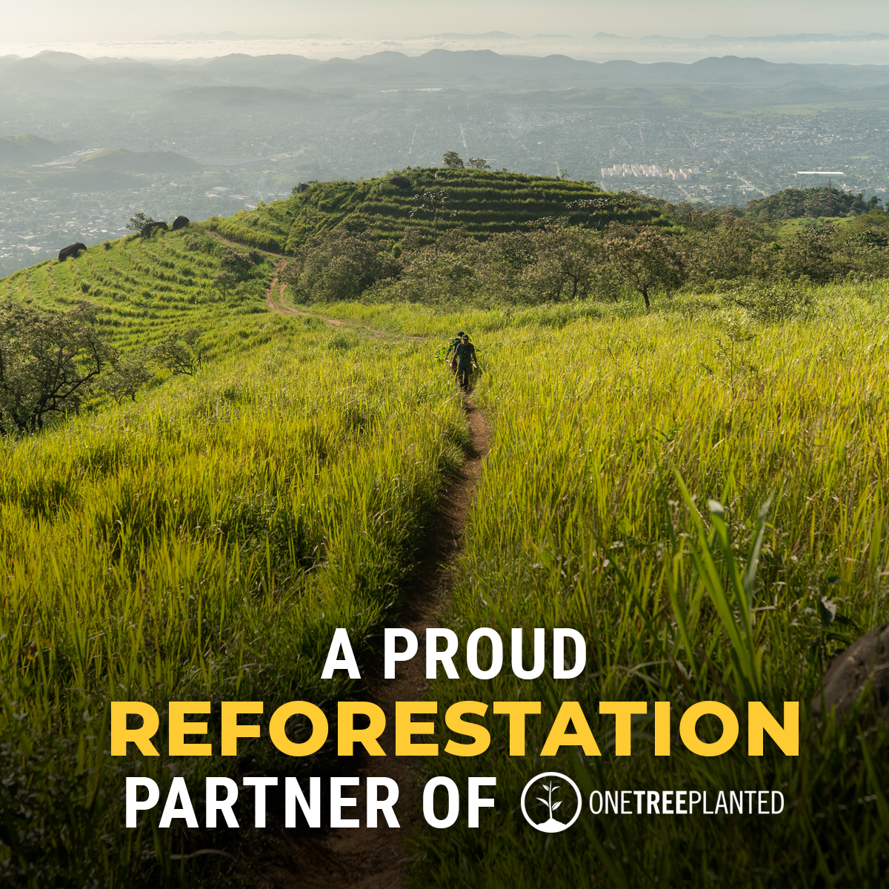
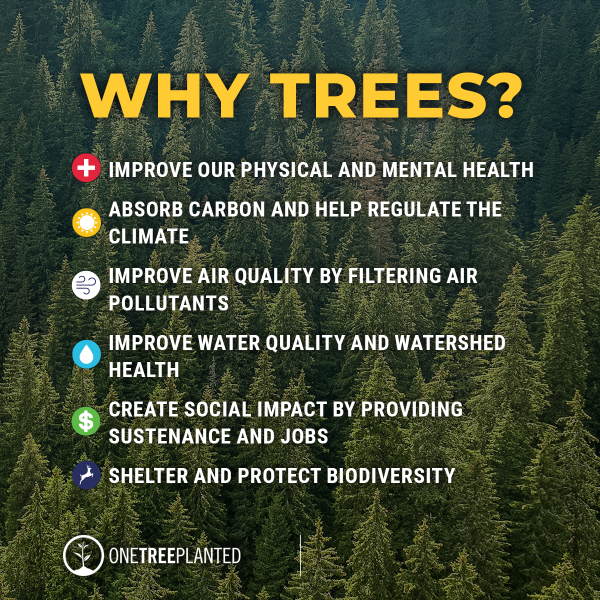

# 🚀 Vision, Mission & Focus: On-Click One-Tree

## Planting Seeds of Hope: A Fundraising Initiative for a Sustainable Future

<figure><figcaption>
myHerb partner with One Tree Planted
</figcaption></figure>

As we navigate the complexities of a changing world, one thing remains clear: our commitment to sustainability must remain unwavering. At \[Your Name/Company Name], we believe that even in challenging times, collective action has immense power. We're excited to announce our partnership with One Tree Planted, a non-profit organization dedicated to global reforestation.

## **Why Trees? Why Now?**

The answer is simple: trees are essential for life. They provide clean air, filter water, support biodiversity, and combat climate change. One Tree Planted's mission resonates deeply with our values, and we're proud to join forces in their impactful work.

<figure><figcaption>
6 Benefits for growing and planting trees
</figcaption></figure>

## **Our Fundraising Goal: Making a Tangible Difference**

We understand that the current economic climate presents challenges for everyone. However, we believe that even small contributions can create a significant impact. We aim to raise \[Target Amount] to support One Tree Planted's reforestation efforts.

## **Transparency and Impact:**

To ensure transparency and maximize impact, 90% of the funds raised will directly support tree-planting initiatives. The remaining 10% will cover essential administrative costs, enabling us to manage the campaign effectively and keep our operations sustainable.

<figure><figcaption></figcaption></figure>

## **Introducing TreeWise.io: Planting Trees, One Click at a Time**

We are also thrilled to introduce our innovative project, TreeWise.io (formerly known as myTree). This platform will revolutionize how we interact with sustainability, making it easy and engaging to contribute to a greener future.

<figure><figcaption></figcaption></figure>

### Here's how it works:

* **Planting Through Action:** Every interaction on TreeWise.io, from filling out a form to making a purchase, will generate a tree planting.
* **Reducing Plastic Pollution:** We are actively exploring ways to integrate plastic reduction initiatives into the platform.
* **Transparency and Choice:** Users will be able to choose where their trees are planted, learn about the specific tree species, and even access a gallery of their planted trees.
* **Community Building:** TreeWise.io will foster a community of environmentally conscious individuals who work together towards a shared vision of a sustainable future.

<figure><figcaption>
TreeWise.io - A big project for Integrative &#x26; Synchronizing AI-Tree Planter Workflow
</figcaption></figure>

## **Join Us in Building a Greener Future**

We invite you to join us in this meaningful journey. Whether through donations or simply spreading the word, your support will make a real difference. Together, we can plant hope and cultivate a more sustainable future for generations.


Donate easy without PayPal account and no need for visa. Safe and discrete payment.



One Tree Planted Fundrasing Campaign for collaborating in Tree planting project.


<table data-view="cards"><thead><tr><th></th><th></th><th></th><th data-hidden data-card-cover data-type="files"></th></tr></thead><tbody><tr><td></td><td>Event > Trigger > Planting a Tree</td><td></td><td><a href="../../.gitbook/assets/7.png">7.png</a></td></tr><tr><td></td><td>Purchase an item > Planting a Tree</td><td></td><td><a href="../../.gitbook/assets/5.png">5.png</a></td></tr><tr><td></td><td>User Join forum or a newsletter > Plant a Tree</td><td></td><td><a href="../../.gitbook/assets/2.png">2.png</a></td></tr><tr><td></td><td>New User Registration > Planting a Tree</td><td></td><td><a href="../../.gitbook/assets/image (1).png">image (1).png</a></td></tr><tr><td></td><td>Filling a form > Planting a Tree</td><td></td><td><a href="../../.gitbook/assets/image (4).png">image (4).png</a></td></tr><tr><td></td><td>Donating to myHerb > Planting a Tree x2</td><td></td><td><a href="../../.gitbook/assets/image (5).png">image (5).png</a></td></tr></tbody></table>

###

### **Get Involved:**

* Please donate to our fundraising campaign: \[Link to Campaign]
* Visit TreeWise.io and learn more about our project: \[Link to Website]
* Share this message with your network and inspire others to take action.

_Let's plant a better tomorrow, today._

**#OneTreePlanted #Sustainability #Fundraising #TreeWise #EnvironmentalImpact**

## Our Vision


**It's good to know that a good vision statement shows the company's long-term goals** without getting too deep into strategy, implementation, or product specifics.


Our company vision is to **be the authoritative reference point for environmentally conscious buyers** and to **encourage more sustainable business practices** by curating beautiful, practical, consciously produced products.
